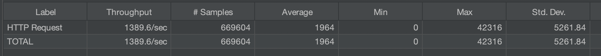
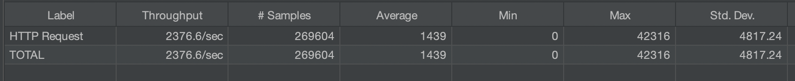
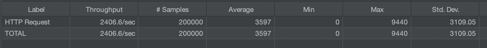
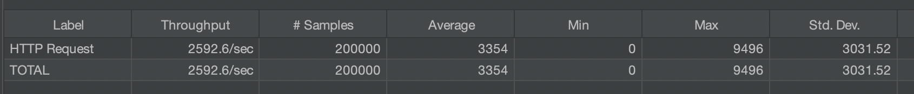
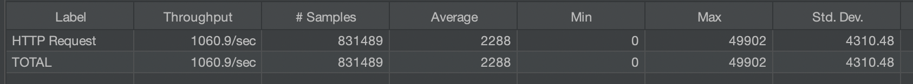

# spring kafka

```
protoc -I=. --java_out=. output.proto
cp guru/bonacci/reactive/kafka/ProtoOutput.java src/main/java/guru/bonacci/reactive/kafka

curl -X POST -H 'Content-Type: application/json' -d '{"foo":"data", "goo":123, "bar":34.21, "baz": true}' localhost:8080/json
```

## performance

### blocking json



### fire and forget json



### reactive json



### reactive avro



### reactive protobuf




```
./bin/kafka-console-consumer \
    --bootstrap-server localhost:9092 \
    --topic json-topic \
    --property print.key=true \
    --property print.value=true

./bin/kafka-avro-console-consumer \
    --bootstrap-server localhost:9092 \
    --topic avro-topic \
    --property schema.registry.url="http://localhost:8081" \
    --property print.value=true

./bin/kafka-protobuf-console-consumer \
    --bootstrap-server localhost:9092 \
    --topic protobuf-topic \
    --property schema.registry.url="http://localhost:8081" \
    --property print.value=true

./bin/kafka-console-consumer \
    --bootstrap-server localhost:9092 \
    --topic json-tx-topic \
    --property print.key=true \
    --property print.value=true \
    --isolation-level=read_uncommitted

./bin/kafka-console-consumer \
    --bootstrap-server localhost:9092 \
    --topic json-tx-topic \
    --property print.key=true \
    --property print.value=true \
    --isolation-level=read_committed
```

---

```
java.lang.IllegalStateException: TransactionalId reactive-json-tx-zT8NV: Invalid transition attempted from state READY to state ABORTING_TRANSACTION
	at org.apache.kafka.clients.producer.internals.TransactionManager.transitionTo(TransactionManager.java:974) ~[kafka-clients-3.4.1.jar:na]
	at org.apache.kafka.clients.producer.internals.TransactionManager.transitionTo(TransactionManager.java:967) ~[kafka-clients-3.4.1.jar:na]
	at org.apache.kafka.clients.producer.internals.TransactionManager.lambda$beginAbort$3(TransactionManager.java:269) ~[kafka-clients-3.4.1.jar:na]
	at org.apache.kafka.clients.producer.internals.TransactionManager.handleCachedTransactionRequestResult(TransactionManager.java:1116) ~[kafka-clients-3.4.1.jar:na]
	at org.apache.kafka.clients.producer.internals.TransactionManager.beginAbort(TransactionManager.java:266) ~[kafka-clients-3.4.1.jar:na]
	at org.apache.kafka.clients.producer.KafkaProducer.abortTransaction(KafkaProducer.java:835) ~[kafka-clients-3.4.1.jar:na]
	at reactor.kafka.sender.internals.DefaultTransactionManager.lambda$null$9(DefaultTransactionManager.java:94) ~[reactor-kafka-1.3.19.jar:1.3.19]
	at reactor.core.publisher.MonoRunnable.call(MonoRunnable.java:73) ~[reactor-core-3.5.8.jar:3.5.8]
	at reactor.core.publisher.MonoRunnable.call(MonoRunnable.java:32) ~[reactor-core-3.5.8.jar:3.5.8]
	at reactor.core.publisher.MonoFlatMap$FlatMapMain.onNext(MonoFlatMap.java:146) ~[reactor-core-3.5.8.jar:3.5.8]
	at reactor.core.publisher.MonoPublishOn$PublishOnSubscriber.run(MonoPublishOn.java:181) ~[reactor-core-3.5.8.jar:3.5.8]
	at reactor.core.scheduler.SchedulerTask.call(SchedulerTask.java:68) ~[reactor-core-3.5.8.jar:3.5.8]
	at reactor.core.scheduler.SchedulerTask.call(SchedulerTask.java:28) ~[reactor-core-3.5.8.jar:3.5.8]
	at java.base/java.util.concurrent.FutureTask.run(FutureTask.java:264) ~[na:na]
	at java.base/java.util.concurrent.ScheduledThreadPoolExecutor$ScheduledFutureTask.run(ScheduledThreadPoolExecutor.java:304) ~[na:na]
	at java.base/java.util.concurrent.ThreadPoolExecutor.runWorker(ThreadPoolExecutor.java:1136) ~[na:na]
	at java.base/java.util.concurrent.ThreadPoolExecutor$Worker.run(ThreadPoolExecutor.java:635) ~[na:na]
	at java.base/java.lang.Thread.run(Thread.java:833) ~[na:na]


```